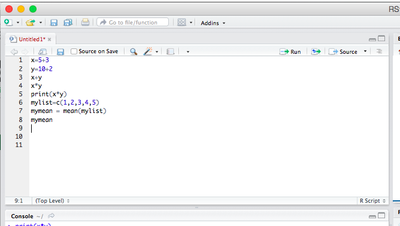
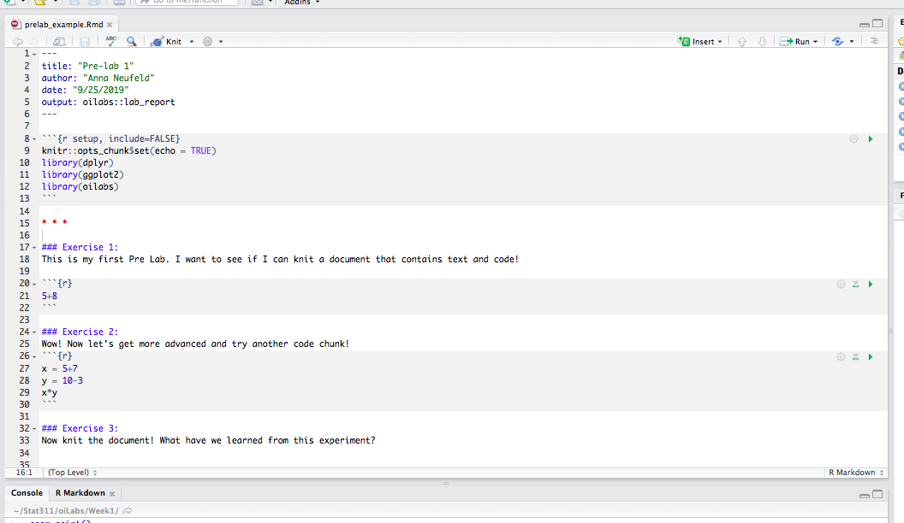

```{r global_options, include=FALSE}
knitr::opts_chunk$set(eval = FALSE)
library(tidyverse)
library(openintro)
```

Throughout the quarter, we will be using R and RStudio for assignments. Before the next section, you must be able to open up RStudio and run a few basic commands. This will leave more time during section to cover substantive material. Before the next section, make sure that you are able to at least execute the commands in the **Your First R Commands** section of this document. Please see a TA during office hours if you are unable to execute these commands. 

# Why R? 

R is an incredibly popular programming language for data analysis; used by statisticians but also by scientists in biology, psychology, economics, chemistry, etc. R is fully featured and very powerful, and unlike Stata or SaaS, it is *free and open source*.
This means that you can continue to use it for free after you finish
this class, and beyond. Additionally, R is *extensible*.
When a statistician develops a new method, or when a scientist decides that they need a specific tool to analyze their specific data, they (or someone who wants to use it in R) will often implement the method as a collection of functions in R called a *package*. Other individuals who want to use the method or conduct a similar type of data analysis can download the package and use these functions without needing to rewrite all of the code themselves. The Comprehensive R Archive Network, or **CRAN**, contains over 13,000 [contributed packages](https://cran.r-project.org/web/packages/). 

# Downloading R and RStudio

If you have used R and RStudio for another course in the past, please still follow all instructions to ensure that you have download the most recent versions.

The programming language itself is called R, and RStudio is a user friendly interface for working with R. To download each tool, use the following links. Download the **most recent version of R** and download the free version of RStudio Desktop.

* http://cran.r-project.org/
* http://www.rstudio.com/ide/download/desktop (pick the free version of RStudio Desktop)

For both R and RStudio, you must **follow the instructions that are appropriate for your operating system** (if you have a Mac, pick the Mac version. Likewise for windows). 

# Getting Started

Once you have both pieces of software downloaded, open up RStudio (as you would open any application). **Make sure you open RStudio and not R**. You should see a screen with three panels. If you are unable to open RStudio and see this screen, please scroll down to the **Help, I'm Stuck** section of this document.  \newpage


The panel on the lower left is where the action happens. It's called the *console*. 
Everytime you launch RStudio, it will have the same text at the top of the 
console telling you the version of R that you're running. Below that information you will see the symbol $>$. This is called the *prompt*: 
it is a request for a command. Initially, interacting with R is all about typing commands into the console
and interpreting the output. 

The panel in the upper right contains your *environment*, which will show you all of your named variables and datasets once you create/load them. You can also view a *history* of all commands you have previously entered in the console. 

Any plots that you generate will show up in the panel in the lower right corner. This is also where you can browse your files, access help, manage packages, etc.

## Installing our packages

For this class, we will be working with a few special R *packages*. 

In order to be able to use these, we need to install them first.  Note that you can check to see which packages (and which versions) are installed by
inspecting the *Packages* tab in the lower right panel of RStudio. Try running the following lines of code in your console. 

```{r install-packages, message = FALSE, eval=FALSE}
install.packages("tidyverse")
install.packages("openintro")
install.packages("remotes")
remotes::install_github("andrewpbray/oilabs")
```

**Don't worry if tons of text prints in your console while you run these lines of code.** Sometimes RStudio gives you many messages while installing packages. 

You may need to select a server from which to download; any of them will work. After running each of these lines, open the *Packages* tab in the lower right hand corner of your RStudio window. Scrolling through the list of packages, you should now see `openintro` and `tidyverse`, along with many other packages. If you are unable to complete this step, don't worry. We will revisit this on the first day of lab to ensure that everyone has the appropriate packages installed. 

**Note: oilabs is installed with a different command because it is a newer package that has been very recently updated. The latest version is not yet on CRAN, so we need to install it directly from the textbook makers, who post the most recent version on github**. 

## Your first R commands

You can interact with RStudio in the console as you would interact with any calculator. To make sure that everything is up and running properly, let's start in the console. Anything that you type after the $>$ (the prompt) will be executed as R code. For example, type ``5+3`` after the prompt and then press enter (return). You should see your answer right away. If instead you type ``x <- 5+3`` and then enter, the console will no longer print out ``8``, but it will save your value of ``x``. Note that ``x`` now appears in your *environment*. Now type ``x`` in the console and hit enter; verify that it prints the appropriate value. 


Please make sure that you are able to execute these commands before the next section. The material below this point will be useful to read, but will also be covered in the next section.  

# Saving your work

Anything that you could ever want to accomplish in R can be done directly in the console. However, if you are writing commands that you might want to save for later, it is better to write these inside a file, rather than in the console. For example, if you are working on an assignment, you probably want to be able to access your code again later to check your work.

The most basic type of file is an R Script file. You can create one by going to File, New File, R Scipt. It should show up in the upper left panel of your screen. This file works just like the console, but instead of running a command every time you click enter, you can write several lines at once without running them. If your cursor is on a certain line, clicking "run" in the top right corner will execute just that line. Clicking "source" will execute all lines at once. Experiment by typing code such as the following into your R Script file. Make sure you are comfortable with the difference between running an individual line and running the whole file.  




RScript files are great for code, but they are not great for communicating your ideas to others. An RMarkdown file lets you intersperse *chunks* of R code with chunks of text and output the result as a nicely formatted document. For lab assignments in this course, you will use RMarkdown to create lab reports that intersperse code with answers to written discussion questions. The following video describes the advantage of RMarkdown files for creating reproducible lab reports. Reproducibility is extremely important in scientific research. 

[**Why use R Markdown for Lab Reports?**](https://youtu.be/lNWVQ2oxNho)
<iframe width="560" height="315" src="https://www.youtube.com/embed/lNWVQ2oxNho" frameborder="0" allowfullscreen></iframe>

We will practice making RMarkdown files during lab section this week, but it will be useful to try one on your own first. The OpenIntro textbook team has created specific R Markdown templates for lab reports that have especially nice formatting. We will be using these templates in this class. The following steps will help you create your first "lab report" in RMarkdown. 

* First of all, the templates we are using are within the ``oilabs`` R package, so we first need to load this package. Type the command ``library(oilabs)`` into your console. 
* In RStudio, select File -> New File -> R Markdown
* In the prompt window that pops up, select "From Template" and then select the "Lab Report" template from the ``oilabs`` package. 
* **If you don't see the Lab Report template option, try restarting RStudio and trying again. If that doesn't fix it, see your TA.**
* A sample document will pop up. Before you start changing anything, select ``knit`` from the button at the top: *knitting* an RMarkdown document means turning the input file (.Rmd) into a nice output file (.html in this case). After knitting, you should see a nice looking html document.  
* In the parts of the document with a white background, you may type anything you want as you would in a word document. In the parts of the document with a gray background, you can type R code as you would type it in the console. 
* To get started, try creating a document like the one below. Make sure that you are able to knit the document and view the output of your code!



For more information about the OpenIntro lab report templates, you can check out the following video. This jumps ahead a little bit because it refers to some material from the next lab assignment. But it reinforces the importance of reproducibility, etc, so it is worth a watch. 

[**OpenIntro Lab Report Templates?**](https://www.youtu.be/Pdc368lS2hk)
<iframe width="560" height="315" src="https://www.youtube.com/embed/Pdc368lS2hk" frameborder="0" allowfullscreen></iframe>


# Help! I'm stuck! 

If you are unable to open RStudio on your machine, try to visit a TA in office hours before Thursday's lab section. The TAs may be able to help you work through error messages and get started. If you are unable to visit office hours before the first lab section, don't fret! While you should eventually have RStudio downloaded on your machine, it is okay to complete the first week's tutorial and lab using the online version of RStudio. The online version avoids the issues that students sometimes run into regarding installation, but it is less ideal for long term use because it tends to be quite slow. 

If you cannot install RStudio, visit [rstudio.cloud](https://rstudio.cloud) and follow the instructions to make an account. Once you have made an account, click "New Project". You should now see the same 3-paneled screen described in the section **Getting Started** above. Work through the rest of this pre-lab using this online RStudio: verify that you can use RStudio as a basic calculator by running commands in the console, and attempt to download the required packages. Finally, practice creating and knitting an RMarkdown file. 


# Acknowledgements.

This tutorial was adopted from an OpenIntro lab and is developed with work from Anna Neufeld. 
<div id="license">
This is a product of OpenIntro that is released under a 
[Creative Commons Attribution-ShareAlike 3.0 Unported](http://creativecommons.org/licenses/by-sa/3.0). 
This lab was adapted for OpenIntro by Andrew Bray and Mine &Ccedil;etinkaya-Rundel
from a lab written by Mark Hansen of UCLA Statistics.
</div>


