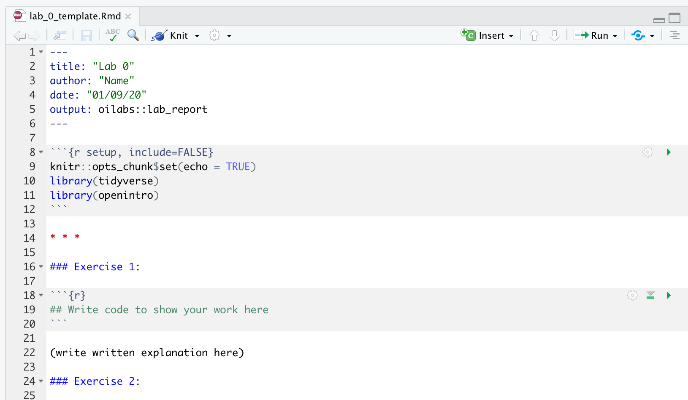
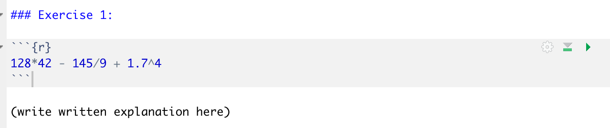

```{r global_options, include=FALSE}
knitr::opts_chunk$set(eval = FALSE)
library(tidyverse)
```


<div id="boxedtext">
**Learning Objectives**

- Become comfortable with the RStudio Interface
- Understand how to record written explanations and code chunks in an RMarkdown file and ``knit`` the file into a report
- Run some fun, basic commands in R
</div>

This lab will require you to run some very basic commands in R. You will explore the various windows in the RStudio interface. You will also practice recording your answers in an RMarkdown lab report and submitting it on Canvas. 

## Getting Started

Hopefully you were able to download R and RStudio by following the Prelab instructions. If so, go ahead and launch RStudio. You should see a window that looks similar to the image shown below (your version will likely be newer).


<br>

The panel on the lower left is where the action happens. It's called the *console*. 
Everytime you launch RStudio, it will have the same text at the top of the 
console telling you the version of R that you're running. Below that information
is the *prompt*. The panel in the upper right contains your *environment* as well as a history of 
the commands that you've previously entered. Any plots that you generate will show up in the panel in the lower right corner. 
This is also where you can browse your files, access help, manage packages, etc.

* * *

### Loading Packages

R is an open-source programming language, meaning that users can contribute
packages that make our lives easier, and we can use them for free. For many labs in the future we will use the following R packages:

- The suite of **tidyverse** packages: for data wrangling and data visualization

Hopefully you were able to install these packages using ``install.packages()`` using the pre-lab instructions. Note that you can check to see which packages (and which versions) are installed by
inspecting the *Packages* tab in the lower right panel of RStudio. If you do not see ``tidyverse`` in this panel, it means that you need to run the following code from the pre-lab. 

```{r install-packages, message = FALSE, eval=FALSE}
install.packages("tidyverse")
```

If you already ran this in the prelab, do not run it again. 

Next, you need to load these packages in your working environment. We do this with
the `library` function. Note that you need to **load** the packages every time you restart RStudio, whereas you only need to **install** the packages once ever. 

```{r load-packages, message = FALSE, eval=TRUE}
library(tidyverse)
```

* * *

### Interacting with R in the Console

As you saw in the pre-lab, the most basic way to interact with RStudio is to use the console as a calculator. Using the console, you can perform basic arithmetic operations (try running `5*12` or `100/11`) and you can assign values to variables (try running `my_variable <- 122` and then check your *Environment* tab). In theory, you could accomplish anything that you wanted using `R` in this manner. However, an important part of statistics is sharing and communicating your work. In order to share your code and analyses with others, you must be able to record your code and save it for later. That is where RMarkdown files come in. 

* * *

## RMarkdown files

If you write all of your code in the console, you will not be able to share your work with anyone else or refer back to it later. We will be using R Markdown to create reproducible lab reports. You should have been able to practice making your first RMarkdown file in the Pre-lab assignment. 

For this lab assignment, we have created a lab report template. Please download the template from Canvas. Then, click on the template to open it as you would open any file. Since the file has the `.Rmd` extension, your computer should automatically open the file in RStudio. If your computer fails to open the file in RStudio, you may also start in RStudio and then use the buttons File, Open File, etc. to navigate to the lab template. 

Once the template is open, you should see the following (with an updated date):


Anything written in this document on plain white background is interpretted as text (write here as you would write in a microsoft word document), and any code written on gray background is interpreted as R code (write here as you would write in the R console, with one command per line). We call the gray areas **code chunks**. 

*Knitting* an RMarkdown document means turning the input file (`.Rmd`) into a nicely formatted output file (`.html` in this case). To knit your current template document, select ``knit`` from the buttons at the top of the RMarkdown file. A nicely formatted document will open up in a new window. 

Note that, when the document is knit, R automatically saves the nicely formatted output file in the same directory as your template file. So you should know have a file called ``lab_0_template.html`` in the same folder as ``lab_0_template.Rmd`` on your computer. If you can't find these files, check your downloads folder (this is the most likely location since you downloaded the template file from CANVAS; feel free to move these files to any folder that you wish). 

Note that, when used on white background, the `#` symbol creates titles and headers that show up in large font in the output document. We use text such as `### Exercise 1` to label the exercises. When used inside of a code chunk, the `#` symbol in R creates a code **comment**.  This can be used to write regular text inside of a code chunk. Any text written in a code chunk after the `#` symbol is ignored; it is not run as R code. We use comments to leave you messages inside of lab and HW templates, such as "write your answer here". 

### Running code in RMarkdown files

Right now, the only text in the grey boxes in your template file is comments, and so you haven't actually written any code. This course is all about writing and executing code, so we should get started with our first exercise.

1. Use R to compute $128 \times 42 - \frac{145}{9} + 1.7^4$. Round your answer to 1 decimal place. 

You should write the code to compute this in your lab template document. 



Just typing the code in the gray chunk is not enough. Now we need to run this code. First note that all code in your chunks is automatically run each time you knit your document. Knit your template document now to try this out! Did it print your answer? 

You can knit your R Markdown file every time you write code, but sometimes the knitting process takes a few minutes and you just want to run a few lines at a time to make sure they are working. To run chunks without knitting, you can use either the Run button on the chunk 
(green sideways triangle) or you can highlight the code and click Run on the top 
right corner of the R Markdown editor. While it is good to run individual chunks to test out ideas and explore, we also strongly recommend that you **knit your document** each time you finish an exercise. The knitting process can sometimes lead to errors. Students often run in to trouble if they wait to try knitting their document until right before the assignment deadline. Kniting after each exercise ensures that you catch errors as you go. 

Finally, on lab templates we often give you space for both code and written explanations. For example, the code chunk will be for creating a plot and the written explanation will be for describing the plot. On this lab, there is not much to describe, so for your written explanations you may just use the written answer in a sentance (example: "the answer is 42").  

* * *

## Creating variables

You saw on the pre-lab that you can also define variables in R and save values to these variables. Complete the following two exercises.

2. Use R to compute the value $\sqrt{1127}$. Save this value to a variable `X`. 

Note that, for this exercise, you will need the special symbol `<-`. The symbol `<-` performs an *assignment*, taking the output of one line of code and saving it into an object in your environment.  

3. Use R to compute the value $\sqrt{1+2+3+4}$. Create a variable `statistics_is_fun` that stores this value. 

4. Using R, compute $\frac{X + statistics\_is\_fun}{X}$. 

Be sure to knit your document before moving on. Is everything working okay? 

* * *

### Common errors

When an R Markdown document is knitting, it only has access to the variables that are created inside of the R Markdown document itself. The R Markdown document does not get to use the environment in the upper right hand corner of your screen while it is knitting. The R Markdown document only gets to see the variables that are defined inside of the document. To illustrate this concept, run the following three lines of code in your **console**.

```{r}
z <- 12
y <- 17
z - y
```

The lines should work fine, and -5 should be printed. Now, try putting the code `z-y` into a code chunk in your R Markdown document, and try to knit the document. What happened? Why did this happen? Discuss as a group.  

It is also important in an R Markdown document that all variables are defined in order. You will notice that exercise 5 contains two code chunks in your template. What happens if you put ``x-y`` in the first code chunk and you put ``z <- 12`` and ``y <- 17`` in the second code chunk? Try knitting the document. What happens? Why? 

5. Resolve the issue that you ran into above so that exercise 5 correctly saves a variable called `z`, a variable called `y`, and prints the difference. 

***

## Additional Practice

Variables in R can be more than just numbers! If there is time left in section, play around with the following lines of code in your console. You do not need to turn anything in for this part of the assignment, and if you don't get to it during section you do not need to worry about it. 

First, let's explore what happens when we work with text in R. Does it make sense to add two variables when they are not numbers? Discuss!

```{r, eval=FALSE}
x <- "cat"
y <- "dog"
x*y
```

In statistics, we often are not working with one number at a time. We are often working with lists of numbers; datasets! We can make our first small dataset in R using the `c()` function, which binds elements together in a list. Discuss the following lines of code as a group.

```{r, eval=FALSE}
data <- c(1,5,7,8,9,10,12,13)
mean(data)
data+5
mean(data+5)
data[3]
```

*** 

## Conclusion

Today, we performed some basic calculations in R. The primary purpose was to give you practice making and knitting an RMarkdown document. Next week, we will start working with real datasets in R using the **tidyverse** packages. 

## Acknowledgements

This tutorial uses the OpenIntro formatting template and is developed with work from Anna Neufeld.

<div id="license">
This is a product of OpenIntro that is released under a 
[Creative Commons Attribution-ShareAlike 3.0 Unported](http://creativecommons.org/licenses/by-sa/3.0). 
</div>
