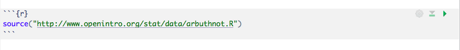

```{r global_options, include=FALSE}
knitr::opts_chunk$set(eval = FALSE)
library(tidyverse)
library(openintro)
```


<div id="boxedtext">
**Learning Objectives**

- Become comfortable with the RStudio Interface
- Practice recording written explanations and code chunks in an RMarkdown file and ``knit``ing the file into a report
- Import and explore a dataset; work with individual rows and columns
- Create simple visual and numerical summaries of the data
- Manipulate a dataset to add new variables 
</div>

As the labs progress, you are encouraged to explore beyond what the labs dictate;
a willingness to experiment will make you a much better programmer. Before we get to that stage, however, you need to build some basic fluency in R. Today we begin with the fundamental building blocks of exploring and summarizing data in R. 

Note that the exercises interspersed in this tutorial are just for practice; you do not need to submit anything from this tutorial. However, we will practice writing up our work in an RMarkdown report. Having your code from this tutorial saved in a reproducible report will allow you to refer back to the code and will help you complete Lab 1 and HW2. 

As a final note, please **read all of the text in the document**. Often, students skip quickly through labs and only pay attention to code chunks and exercises. The text in the labs and tutorials highlights important concepts that you are expected to know. 

## The Basics

Launch RStudio. You should see the familiar window that looks like the image 
shown below.


<br>

If you are not able to see this window, please review the prelab and Lab 0. As a reminder from Lab 0, the lower left panel is called the *console*. The panel in the upper right contains your *environment*, which will show you the variables and the datasets that you are currently working with. 

* * *

### Loading Tidyverse

As we discussed during lab 0, R is made up of many user-contributed *packages*. For this lab,
and many others in the future, we will rely heavily on the suite of **tidyverse** packages. The **tidyverse** is a collection of packages for data wrangling and data visualization. The tidyverse is extremely popular because it is flexible, powerful, and user-friendly. In the prelab, you should have installed the tidyverse using ``install.packages()``. 

You can check to see which packages (and which versions) are installed by
inspecting the *Packages* tab in the lower right panel of RStudio. If you do not see ``tidyverse`` in this panel, it means that you need to revisit the pre-lab and follow the instructions to install the packages. 

You only need to **install** a package once. However, in order to actually use a package, you must load it into your working environment. This is done with the `library` function. Note that you need to **load** the packages every time you restart RStudio. Furthermore, you must load all packages inside of your RMardown document every time you complete a homework or a lab. 

```{r load-packages, message = FALSE, eval=TRUE}
library(tidyverse)
```

* * *

### Saving your work

As you saw in Lab 0, we will be using R Markdown to create reproducible lab reports. An RMarkdown template for this tutorial has been posted on Canvas. Note that you do not need to turn anything in for today's tutorial; you should feel free to use the R Markdown template to store scratchwork and notes for yourself.

Once you have opened the template, remember that anything written in this document on plain white background is interpretted as text (write here as you would write in a microsoft word document), and any code written on gray background is interpreted as R code (write here as you would write in the R console, with one command per line). 

Recall from Lab 0 that knitting the RMarkdown file results in all chunks of code being executed in order. You can also run individual chunks of code by using the green Run button on the chunk 
(green sideways triangle) or by highlighting the code and then clicking Run on the top 
right corner of the R Markdown editor. If at any point you need to start over, you 
can Run All Chunks above the chunk you're working in by clicking on the down
arrow in the code chunk.

* * *

## Exploring your data

### Loading the data

To begin exploring the functionality of R, we will work with a real dataset. Typically, to begin working with R you would upload your own dataset of interest with the ``Import Dataset`` button in the environment panel (datasets can be loaded from .csv files, Excel files, etc.). However, your OpenIntro textbook has some great datasets that we can ``source`` directly from the textbook website. One such dataset is called ``arbuthnot``. This dataset contains the work of Dr. John Arbuthnot, an  18<sup>th</sup> century physician, writer, and mathematician. He was interested in the ratio of newborn boys to newborn girls, so he gathered the baptism records for children born in London for every year from 1629 to 1710. 

To get started, run the following command to load the data.

```{r load-abrbuthnot-data, eval=TRUE}
source("http://www.openintro.org/stat/data/arbuthnot.R")
```

If you are working in an R Markdown file, write this command in a *code chunk*, as follows:



You can run the command without knitting the document by: 
- clicking on the green arrow at the top right of the code chunk in the R Markdown (Rmd) 
file, or
- putting your cursor on this line, and clicking the **Run** button on the upper right 
corner of the pane, or
- holding `Ctrl-Shift-Enter`, or
- typing the code in the console.

This command instructs R to load
the Arbuthnot baptism data. You should see that the 
environment area in the upper righthand corner of the RStudio window now lists a 
data set called `arbuthnot` that has 82 observations on 3 variables. As you 
interact with R, you will create a series of objects. Sometimes you load them as
we have done here, and sometimes you create them yourself as the byproduct of a 
computation or some analysis you have performed.

* * * 

### A bird's-eye view

We can view the data by typing its name into the console.

```{r view-data}
arbuthnot
```

Printing the whole dataset in the console is not that useful. 
One advantage of RStudio is that it comes with a built-in data viewer. Click on
the name `arbuthnot` in the *Environment* pane (upper right window) that lists 
the objects in your environment. This will bring up an alternative display of the 
data set in the *Data Viewer* (upper left window). 

You should see four columns of numbers, each row representing a 
different year: the first entry in each row is simply the row number, the second is 
the year, and the third and fourth are the numbers of boys and girls baptized 
that year, respectively. Use the scrollbar on the right side of the console 
window to examine the complete data set.

Note that the row numbers in the first column are not part of Arbuthnot's data. 
R adds them as part of its printout to help you make visual comparisons. You can
think of them as the index that you see on the left side of a spreadsheet. In 
fact, the comparison to a spreadsheet will generally be helpful. R has stored 
Arbuthnot's data in a kind of spreadsheet or table called a *data frame*.

You can see the dimensions of this data frame as well as the names of the variables 
and the first few observations by typing:

```{r glimpse-data}
glimpse(arbuthnot)
```

This command should output the following

```{r glimpse-data-result, echo=FALSE, eval=TRUE}
glimpse(arbuthnot)
```

We can see that there are 82 observations and 3 variables in this dataset. The variable names are `year`, `boys`, and `girls`. At this point, you might notice 
that many of the commands in R look a  lot like functions from math class; that 
is, invoking R commands means supplying a function with some number of arguments. 
The `glimpse` command, for example, took a single argument, the name of a data frame. 

* * *

### A closer look

Let's start to examine the data a little more closely by looking at specific rows and columns. We can access the data in
a single column of a data frame separately using the command

```{r view-boys}
arbuthnot$boys
```

This command will only show the number of boys baptized each year. The dollar
sign basically says "go to the dataframe named ``arbuthnot`` and find the variable called ``boys``. While the dollar sign is still commonly used in R, the tidyverse packages allow us to extract the same information in a different way. Try out the following command: 

```{r}
arbuthnot %>% select(boys)
```

The `%>%` notation is commonly used in the tidyverse;  `%>%` is called the **piping** 
operator. Here it says "take the arbuthnot dataset and select the column called \`boys\'". The main advantage of the piping operator is that it will later allow us to string several commands together. 

You may have noticed a subtle difference in the way that R printed the data for the previous two commands. For ``arbuthnot$boys``, R printed a list of 82 numbers that were no longer displayed as a table.  Objects that print out in this way are called *vectors*; 
they represent a set of numbers. For ``arbuthnot %>% select(boys)``, R printed a table with 82 rows and 1 column. When you call ``arbuthnot %>% select(boys)``, R creates a new, smaller dataframe that has only one variable. 

The advantage of the ``select`` approach is that we can select several columns at once, which we cannot do with the dollar sign approach. For example, we can make a new dataset that contains both the year and the number of boys baptized in that year. 

```{r}
arbuthnot %>% select(boys, year)
```

1. What command would you use to extract just the counts of girls baptized? Try
    it!
    
Apart from `select()`, another useful function is `filter()`. While `select()` lets us isolate certain columns of a dataset, `filter()` lets us isolate certain rows. Try out the following command and discuss what it does:

```{r}
arbuthnot %>% filter(year > 1685)
```

Suppose that we want only the row for the year 1685. We use the `filter()` command, but we also need to use a funny double-equals-sign notation. The `==` is a *logical operator* that asks the question *is equal to?*. 

```{r}
arbuthnot %>% filter(year == 1685)
```
   

<div id="boxedtext">
**Logical operators: ** Filtering for certain observations (e.g. births from a
particular year) is often of interest in data frames where we might want to
examine observations with certain characteristics separately from the rest of
the data. To do so, you can use the `filter` function and a series of
**logical operators**. The most commonly used logical operators for data
analysis are as follows:

- `==` means "equal to"
- `!=` means "not equal to"
- `>` or `<` means "greater than" or "less than"
- `>=` or `<=` means "greater than or equal to" or "less than or equal to"
</div>
   
   
    
We can also see our first exciting example of **piping** two commands together. Suppose we want to see just the number of girls born in each year since 1865. We can use the following command

```{r}
arbuthnot %>% filter(year > 1685) %>% select(girls)
```

2. In which years did the number of boys baptized exceed 8000? In which years did the number of girls baptized exceed 8000? 

* * *

## Summarizing your data

### Visual summaries: your first plots

R has some powerful functions for visual summaries of *univariate* or *bivariate* data. 

Let's start with univariate data. Perhaps we want a visual summary of a single variable, such as the number of girls baptized in a given year. We could choose to display this with a histogram.

```{r}
ggplot(data = arbuthnot, aes(x = girls)) +
  geom_histogram(binwidth=500)
```

If you run the plotting code in  your console, you should see the plot appear under the *Plots* tab of the lower right panel of RStudio. We can use the powerful `ggplot()` function to build all sorts of plots. The format of the code to build different types of plots with `ggplot()` tends to follow a similar format.  
- The first argument is always the dataset. 
- Next, you provide the variables from the dataset to be assigned to `aes`thetic 
elements of the plot, e.g. the x and the y axes. Here, for a univariate display, we only have an x variable.  
- Finally, you use another layer, separated by a `+` to specify the `geom`etric 
object for the plot. Since we want a histogram, we use `geom_histogram`
- Specific types of plots have their own unique extra arguements. For a histogram, we can specify the binwidth. 

On your own time, try modifying the above code with different bin widths. Which bin width seems to best show the distribution of the data? 

Sometimes we want a bivariate visual summary of our data to explore the relationship between two variables. For example, suppose we want to see how the number of girls baptized each year has changed over time. We can create a scatter plot of the variable ``girls`` against the variable ``year``. 

```{r plot-girls-vs-year}
ggplot(data = arbuthnot, aes(x = year, y = girls)) + 
  geom_point()
```

Notice that the command looks just like our histogram command, but now we have both an X and a Y variable, and we are creating a scatterplot (`point`) instead of a histogram. If you wanted to visualize the above plot using a line graph, you 
would replace `geom_point()` with `geom_line()`.

```{r plot-girls-vs-year-line}
ggplot(data = arbuthnot, aes(x = year, y = girls)) + 
  geom_line()
```

You might wonder how you are supposed to know the syntax for the `ggplot` 
function. Thankfully, R documents all of its functions extensively. To learn what
a function does and its arguments that are available to you, just type in a 
question mark followed by the name of the function that you're interested in. 
Try the following in your console:

```{r plot-help, tidy = FALSE}
?ggplot
```

Notice that the help file replaces the plot in the lower right panel. You can 
toggle between plots and help files using the tabs at the top of that panel. 

3. Is there an apparent trend in the number of girls baptized over the years? 
How would you describe it? (In your RMarkdown document,
be sure to include the code needed to make the plot as well as your written
interpretation.)

* * *

### Numerical Summaries: means and more

Suppose that instead of visual summaries, we want numerical summaries of our data. This is quite easy using the tidyverse. Try out some of the following commands and discuss with your neighbor: what do you think these commands are doing?

```{r}
arbuthnot %>% summarize(av_girls = mean(girls), av_boys = mean(boys))
arbuthnot %>% summarize(sd_girls = sd(girls), sd_boys =sd(boys))
```

<!-- <div id="boxedtext"> -->
<!-- **Summary statistics: ** Some useful function calls for summary statistics for a  -->
<!-- single numerical variable are as follows: -->

<!-- - `mean` -->
<!-- - `median` -->
<!-- - `sd` -->
<!-- - `var` -->
<!-- - `IQR` -->
<!-- - `min` -->
<!-- - `max` -->
<!-- - `n` -->

<!-- Note that each of these functions takes a single vector as an argument and  -->
<!-- returns a single value.  -->
<!-- </div> -->

We can also view the five-number-summary for boys and girls separately. We do this in a slightly different way because "five-number-summary" (or just ``summary()`` in R) is not a command that returns a single value. 

```{r}
arbuthnot %>% select(girls) %>% summary()
arbuthnot %>% select(boys) %>% summary()
```

The ``summary()`` function in R provides the 5-number summary with the added bonus of the mean. It is a useful to way to get a sense of the spread of the data, as well as the center of the data. 

1. On average, were more boys or more girls baptized? Does your answer change if you use a different measure of center? 

* * * 

## Maniupulating your data

Suppose we want to plot the total number of baptisms. To compute this, we 
could use the fact that R is really just a big calculator. We can type in 
mathematical expressions like

```{r calc-total-bapt-numbers}
5218 + 4683
```

to see the total number of baptisms in 1629. We could repeat this once for each 
year, but there is a faster way. We can have R create a new variable for us, and we can define this new variable with a mathematical expression. Try out the following code: 

```{r calc-total-bapt-vars-save}
arbuthnot <- arbuthnot %>%
  mutate(total = boys + girls)
```

You have made a change to your dataset! To view the changes, click on the name of the dataset in your ``environment`` again to update it in the data viewer. You'll see that there is now a new column called `total` that has been tacked on
to the data frame. Our code is equivalent to going through each row and adding up the `boys` 
and `girls` counts for that year and recording that value in a new column called
`total`.

<div id="boxedtext">
Suppose that we had only run the code `arbuthnot %>%
  mutate(total = boys + girls)`. 
This would print the desired dataframe (arbuthnot with the new `total` column), but would not save it anywhere. The special symbol `<-` performs an *assignment*, taking the 
output of one line of code and saving it into an object in your environment. In 
this case, you already have an object called `arbuthnot`, so this command updates
that data set with the new mutated column.
</div>

You can make a line plot of the total number of baptisms per year with the 
command

```{r plot-total-vs-year}
ggplot(data = arbuthnot, aes(x = year, y = total)) + 
  geom_line()
```

Similarly, you can compute the boy-to-girl ratio or the proportion of newborns that are born in each year with the following commands. 

```{r calc-prop-boys-to-girls-vars}
arbuthnot <- arbuthnot %>%
  mutate(boy_to_girl_ratio = boys / girls, boy_prop = boys / total)
```

Note that we are using the new `total` variable we created earlier in our 
calculations.

3. Now, generate a plot of the proportion of boys born over time. What do you see? 

Finally, in addition to simple mathematical operators like subtraction and 
division, you can ask R to make comparisons like greater than, `>`, less than,
`<`, and equality, `==`. For example, we can ask if the number of births of boys
outnumber that of girls in each year with the expression

```{r boys-more-than-girls}
arbuthnot <- arbuthnot %>%
  mutate(more_boys = boys > girls)
```

This command adds a new variable to the `arbuthnot` dataframe containing the values
of either `TRUE` if that year had more boys than girls, or `FALSE` if that year 
did not (the answer may surprise you). This variable contains a different kind of 
data than we have encountered so far. All other columns in the `arbuthnot` data 
frame have values that are numerical (the year, the number of boys and girls). Here, 
we've asked R to create *logical* data, data where the values are either `TRUE` 
or `FALSE`. In general, data analysis will involve many different kinds of data 
types, and one reason for using R is that it is able to represent and compute 
with many of them.

One interesting aspect of logical data is that R actually treats the value `TRUE` as `1` and `FALSE` as `0`. That means that if we want to know the total number of years in which the number of boys exceed the number of girls, we can just as R for a `sum` of the `more_boys` variable.

```{r}
arbuthnot %>% summarize(num_years_more_boys = sum(more_boys))
```

Interestingly, there are only 82 rows in the whole dataset! This means that, in every single year, more boys than girls were baptized. 

* * *

## Additional Resources

That was a short introduction to working with data in RStudio, but we will provide you with more
functions and a more complete sense of the language as the course progresses. 

In this course we will be using the suite of R packages from the **tidyverse**. 
The book [R For Data Science](https://r4ds.had.co.nz/) by Grolemund and Wickham is a fantastic resource for data analysis in R with the tidyverse. 
If you are googling for R code, make sure to also include these package names in your search query. For example, instead of googling "scatterplot in R", google "scatterplot in R tidyverse".

These cheatsheets may come in handy throughout the semester:

- [RMarkdown cheatsheet](https://github.com/rstudio/cheatsheets/raw/master/rmarkdown-2.0.pdf)
- [Data transformation cheatsheet](https://github.com/rstudio/cheatsheets/raw/master/data-transformation.pdf)
- [Data visualization cheatsheet](https://github.com/rstudio/cheatsheets/raw/master/data-visualization-2.1.pdf)

In addition, I encourage you to check out the lecture slides I created for STAT 302: Statistical computing. They are quite handy, if I do say so myself! (I frequently find myself using my own lecture slides as a reference when I forget how to do certain things.) In particular, check out weeks 1--4.

- [STAT 302 Lecture Slides Webpage](https://bryandmartin.github.io/STAT302/lectureslides.html)

Note that some of the code on these cheatsheets may be too advanced for this course.
However the majority of it will become useful throughout the semester.

* * *

## Acknowledgements

This tutorial was modified by Anna Neufeld from the Introduction to R lab available from the OpenIntro set of labs, which are available here: https://www.openintro.org/stat/labs.php

<div id="license">
This is a product of OpenIntro that is released under a 
[Creative Commons Attribution-ShareAlike 3.0 Unported](http://creativecommons.org/licenses/by-sa/3.0). 
This lab was adapted for OpenIntro by Andrew Bray and Mine &Ccedil;etinkaya-Rundel
from a lab written by Mark Hansen of UCLA Statistics.
</div>
